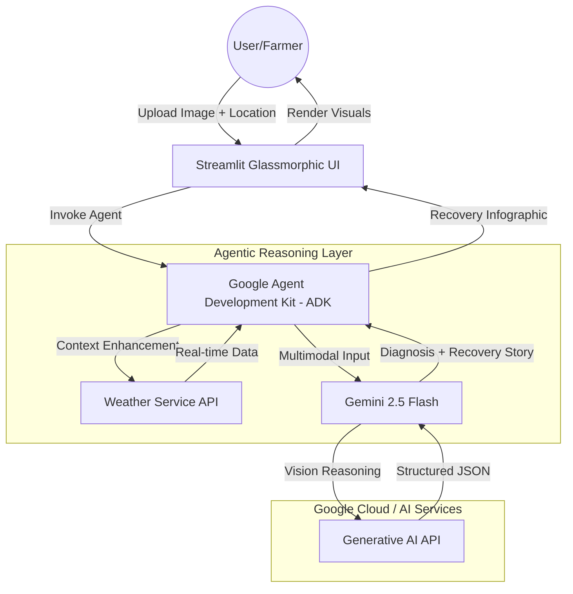

# Architecture Diagram: PlantGuardian AI

This diagram illustrates the flow of data from the User UI through the Agentic framework and Google Cloud services.

```mermaid
graph TD
    User((User/Farmer)) -->|Upload Image + Location| Streamlit[Streamlit Glassmorphic UI]
    Streamlit -->|Invoke Agent| ADK[Google Agent Development Kit - ADK]
    
    subgraph "Agentic Reasoning Layer"
        ADK -->|Context Enhancement| WS[Weather Service API]
        WS -->|Real-time Data| ADK
        ADK -->|Multimodal Input| Gemini[Gemini 2.5 Flash]
    end
    
    subgraph "Google Cloud / AI Services"
        Gemini -->|Vision Reasoning| AI[Generative AI API]
        AI -->|Structured JSON| Gemini
    end
    
    Gemini -->|Diagnosis + Recovery Story| ADK
    ADK -->|Recovery Infographic| Streamlit
    Streamlit -->|Render Visuals| User
```
